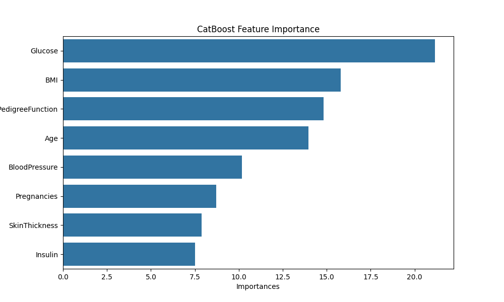
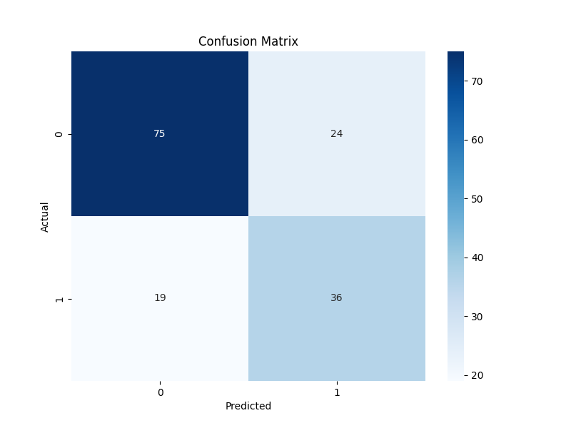

# CatBoost for Diabetes Prediction: An MLOps POC

This project provides a complete end-to-end Proof-of-Concept (POC) for a machine learning operations (MLOps) pipeline using the CatBoost algorithm to predict the onset of diabetes. It includes data generation, model training, experiment tracking with MLflow, and API deployment with FastAPI.

This repository is designed to showcase a production-ready MLOps workflow, making it a valuable addition to a data science or MLOps portfolio.

## Table of Contents
- [CatBoost Algorithm](#catboost-algorithm)
  - [Core Concepts](#core-concepts)
  - [Key Features](#key-features)
  - [Mathematical Intuition](#mathematical-intuition)
  - [Industry Use Cases](#industry-use-cases)
- [Project Structure](#project-structure)
- [Installation Guide](#installation-guide)
- [How to Run the Project](#how-to-run-the-project)
  - [1. Generate the Dataset](#1-generate-the-dataset)
  - [2. Train the Model](#2-train-the-model)
  - [3. Serve the Model with FastAPI](#3-serve-the-model-with-fastapi)
- [Model Performance](#model-performance)
  - [Feature Importance](#feature-importance)
  - [Confusion Matrix](#confusion-matrix)

---

## CatBoost Algorithm

CatBoost is a high-performance gradient boosting on decision trees library. Developed by Yandex, it is particularly powerful for its handling of categorical features and its robust performance out-of-the-box.

### Core Concepts

- **Gradient Boosting**: CatBoost is a gradient boosting framework. It builds an ensemble of decision trees sequentially, where each new tree corrects the errors of the previous ones. The "gradient" refers to the use of the gradient of the loss function to identify the weaknesses of the current model.

- **Oblivious Decision Trees**: Unlike traditional decision trees that can have different splitting features at different nodes, CatBoost uses "oblivious" trees. In these trees, the same splitting criterion is used across all nodes at the same level. This leads to balanced, less complex trees, which helps prevent overfitting and significantly speeds up execution on CPUs.

- **Ordered Boosting**: To combat the "target leakage" problem present in standard gradient boosting implementations (where information from the target variable inadvertently leaks into the training process), CatBoost employs a technique called **Ordered Boosting**. It involves training the model on a permutation of the training data, where for each sample, the model is updated using only the samples that appeared before it in the permutation.

### Key Features

1.  **Categorical Feature Handling**: CatBoost has a unique and powerful way of handling categorical features automatically. It uses a combination of one-hot encoding for low-cardinality features and a sophisticated target-based encoding for high-cardinality features.
2.  **Reduced Overfitting**: The use of oblivious trees and ordered boosting makes CatBoost less prone to overfitting compared to other gradient boosting libraries.
3.  **Excellent Performance**: It often delivers state-of-the-art results without extensive hyperparameter tuning.
4.  **GPU and CPU Support**: CatBoost is optimized for both CPU and GPU, making it scalable for large datasets.

### Mathematical Intuition

At its core, gradient boosting builds a model in a stage-wise fashion. Let $F_{m-1}(x)$ be the model at stage $m-1$. The model at stage $m$ is:

$$ F_m(x) = F_{m-1}(x) + h_m(x) $$

where $h_m(x)$ is the new tree that is trained to predict the negative gradient of the loss function with respect to the previous model's prediction. For a squared error loss $L(y, F) = \frac{1}{2}(y - F)^2$, the negative gradient is simply the residual $y - F_{m-1}(x)$.

CatBoost introduces a more robust way to calculate these gradients for categorical features, using a concept similar to target encoding but with the added protection of ordered boosting to prevent leakage.

### Industry Use Cases

- **Finance**: Credit scoring, fraud detection, and algorithmic trading.
- **E-commerce**: Recommendation systems, click-through rate (CTR) prediction, and customer lifetime value prediction.
- **Healthcare**: Disease prediction, patient risk stratification, and personalized medicine.
- **Manufacturing**: Predictive maintenance and quality control.

---

## Project Structure

```
CatBoost/
├─── diabetes_dataset.csv
├─── generate_data.py
├─── LICENSE
├─── README.md
├─── requirements.txt
├─── serve_fastapi.py
├─── train.py
├─── images/
│   ├─── confusion_matrix.png
│   └─── feature_importance.png
├─── models/
│   └─── catboost_model.bin
└─── mlruns/
    ...
```

---

## Installation Guide

1.  **Clone the repository**:
    ```bash
    git clone <your-repo-url>
    cd CatBoost
    ```

2.  **Create a virtual environment** (recommended):
    ```bash
    python -m venv venv
    source venv/bin/activate  # On Windows, use `venv\Scripts\activate`
    ```

3.  **Install the dependencies**:
    ```bash
    pip install -r requirements.txt
    ```

---

## How to Run the Project

Follow these steps to run the full MLOps pipeline.

### 1. Generate the Dataset

First, run the `generate_data.py` script to download the Pima Indians Diabetes dataset.

```bash
python generate_data.py
```

This will create the `diabetes_dataset.csv` file in the root directory.

### 2. Train the Model

Next, run the `train.py` script to train the CatBoost model. This script will also log the experiment to MLflow under the experiment name "Diabetes Prediction - CatBoost".

```bash
python train.py
```

After running, you will see the model's performance metrics printed to the console. The script also saves the trained model to `models/catboost_model.bin` and generates performance plots in the `images/` directory.

To view the MLflow dashboard, run:

```bash
mlflow ui
```

Navigate to `http://127.0.0.1:5000` in your browser to see the logged experiments, including parameters, metrics, and artifacts.

### 3. Serve the Model with FastAPI

Finally, to serve the trained model as a REST API, run the `serve_fastapi.py` script using Uvicorn.

```bash
uvicorn serve_fastapi:app --reload
```

The API will be available at `http://127.0.0.1:8000`. You can interact with the API documentation at `http://127.0.0.1:8000/docs`.

---

## Model Performance

The following plots are generated during the training process and provide insights into the model's performance and interpretability.

### Feature Importance

This plot shows the most influential features in the model's predictions. As we can see, `Glucose`, `BMI`, and `Age` are the top three predictors.



### Confusion Matrix

This confusion matrix shows the model's performance on the test set. It helps visualize the number of correct and incorrect predictions for each class.


